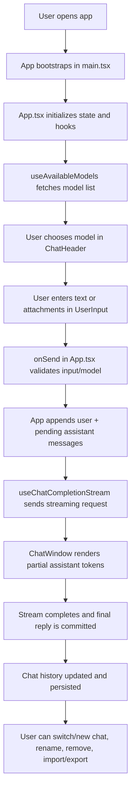

# Chat-UI

A React/TypeScript interface for chatting with any OpenAI compatible endpoint.

## Current functionality

- Streamed chat completions with OpenAI-compatible endpoints
- Model picker populated from the `/v1/models` API
- Chat history with recent search, plus import/export
- Suggested prompts for quick starts
- Optional voice input via browser speech recognition \*

\* Voice input relies on browser speech recognition support and microphone permissions.

## Architecture diagrams

### User flow



### Data flow and security

```mermaid
flowchart LR
    subgraph Browser[Client-side browser app]
        UI[React UI components]
        STATE[Jotai + React state]
        CHAT[useChatCompletionStream]
        MODELS[useAvailableModels]
        API[apiStreamRequest / buildRequest]
        STORAGE[(localStorage)]
        TOAST[Toast/error surface]
    end

    subgraph Remote[OpenAI-compatible API]
        MODELS_EP[/GET /v1/models/]
        CHAT_EP[/POST /v1/chat/completions (SSE)/]
    end

    UI --> STATE
    STATE --> MODELS
    STATE --> CHAT
    MODELS --> API
    CHAT --> API
    API -->|Authorization: Bearer key (if configured)| MODELS_EP
    API -->|Authorization: Bearer key (if configured)| CHAT_EP
    CHAT_EP -->|SSE chunks| CHAT
    MODELS_EP -->|Model list JSON| MODELS
    CHAT -->|Incremental + final assistant text| STATE
    STATE --> UI
    STATE --> STORAGE
    STORAGE --> STATE
    API -->|ApiError + parse failures| TOAST

    SEC1{{Security controls}}
    SEC2{{AbortController
cancels in-flight streams}}
    SEC3{{Idle timeout
for stalled SSE}}
    SEC4{{Image URL/base64 normalization
for compatibility + validation}}

    API -.-> SEC1
    CHAT -.-> SEC2
    API -.-> SEC3
    CHAT -.-> SEC4
```
